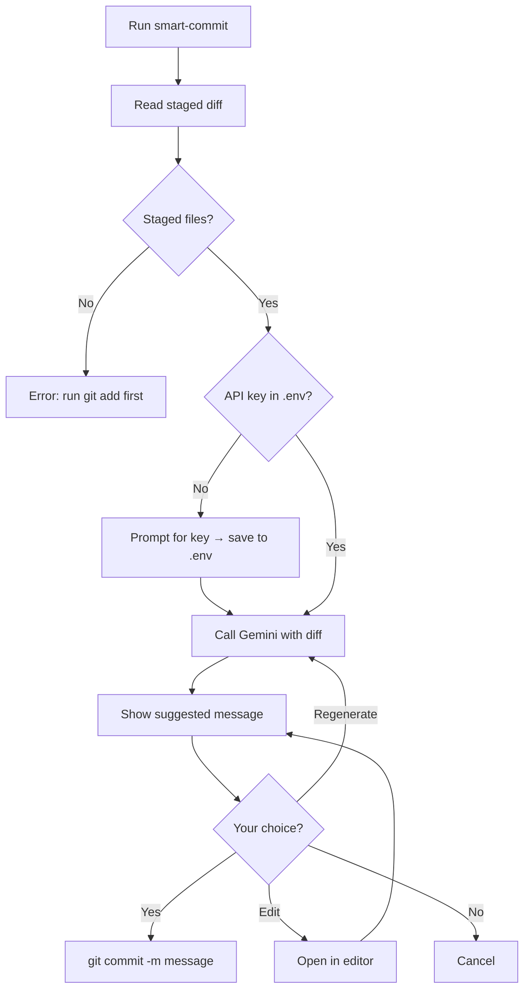

# smart-commit

AI-powered CLI that generates **Conventional Commits** (emoji + subject + optional bullet body) from your staged `git diff` using **Google Gemini**. No more blank or generic commit messages.

---

## Features

| Feature | Description |
|--------|-------------|
| **One-time setup** | Paste your Gemini API key when asked; it’s saved to `.env` in the project. |
| **No manual .env** | First run prompts for the key and creates/updates `.env` for you. |
| **Length-aware** | Small changes → short message; large changes → subject + bullet list. |
| **Edit before commit** | Open the suggested message in your editor (e.g. Notepad, VS Code), edit, save, then confirm. |
| **Git integration** | Optional `git sc` / `git smart-commit` alias so you run it like a Git command. |

---

## Install

| Method | Command | When to use |
|--------|---------|-------------|
| **Global** | `npm install -g @aliklc/smart-commit` | Use `smart-commit` in any repo. |
| **No install** | `npx @aliklc/smart-commit` | One-off or CI; no global install. |

---

## Quick start

1. **Stage changes:**  
   `git add .` (or specific files)

2. **Run the CLI:**  
   `smart-commit` or `npx @aliklc/smart-commit`

3. **First time only:**  
   You’ll be asked for a [Gemini API key](https://aistudio.google.com/apikey) (free). Paste it; the tool saves it to `.env` and won’t ask again.

4. **Choose an action:**

   | Choice | What it does |
   |--------|----------------|
   | **Yes** | Commit with the suggested (or edited) message. |
   | **Edit** | Open the message in your editor; save and close to use the edited text. |
   | **Regenerate** | Ask AI for a new message (same diff). |
   | **No** | Cancel; no commit. |

---

## How it works



- **Input:** `git diff --staged` (only what you staged).
- **AI:** Gemini gets the diff + a prompt (Conventional Commits, emoji, length by change size).
- **Output:** You get one suggested message; you can accept, edit in your editor, or regenerate.

---

## Use as a Git command (optional)

Use `git sc` or `git smart-commit` from any terminal (e.g. Git Bash) after a one-time setup:

| Where | Command |
|-------|---------|
| **Any terminal** | `npx @aliklc/smart-commit --setup-git-alias` |
| **If installed globally** | `smart-commit -s` or `smart-commit --setup-git-alias` |

Then in any repo:

```bash
git add .
git sc
```

---

## Editing the message

When you choose **Edit**:

- The suggested message is opened in your **default editor** (e.g. Notepad on Windows if `EDITOR` is not set).
- You change the text directly, save, and close the editor.
- The CLI reads the file and shows the updated message; you can then **Yes** / **Edit** / **Regenerate** / **No**.

To use VS Code as the editor (optional):

```bash
# Windows (cmd)
set EDITOR=code --wait

# Git Bash / Linux / macOS
export EDITOR="code --wait"
```

---

## Requirements

| Requirement | Details |
|-------------|---------|
| **Node.js** | **20+** |
| **Git** | Repo with staged changes (`git add` before running). |
| **Gemini API key** | Free at [Google AI Studio](https://aistudio.google.com/apikey). |

---

## License

ISC
